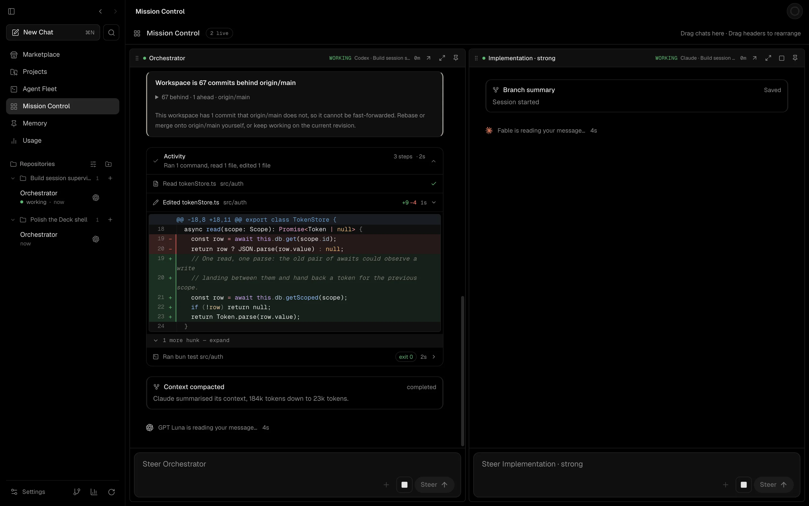
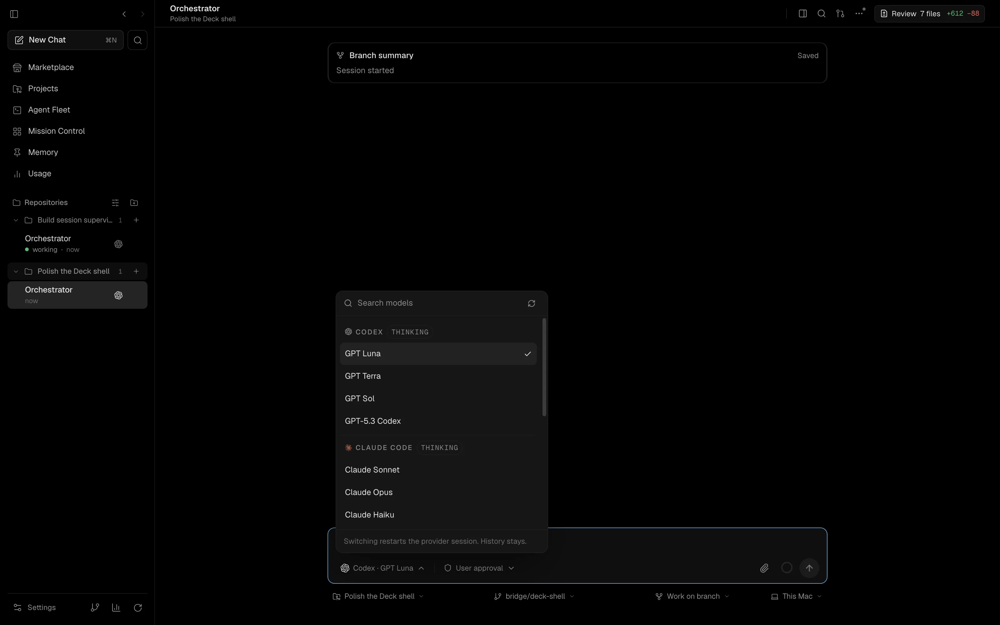
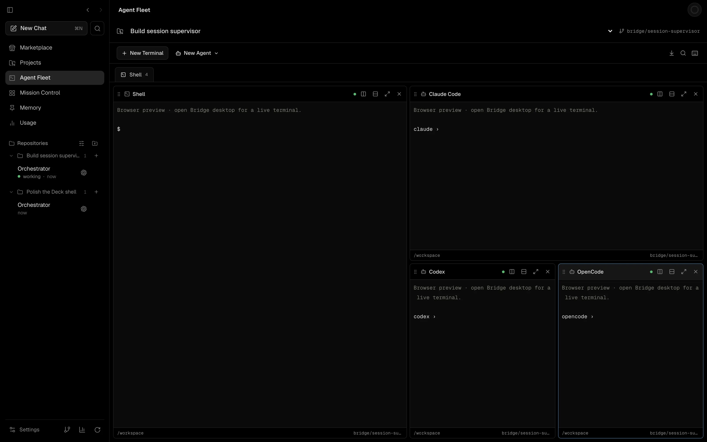
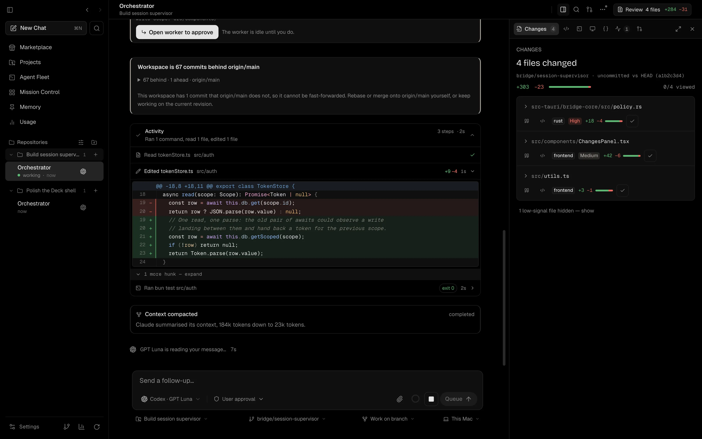
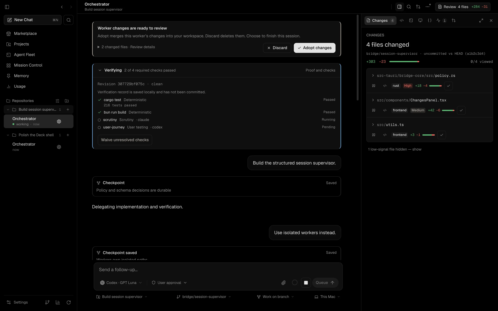
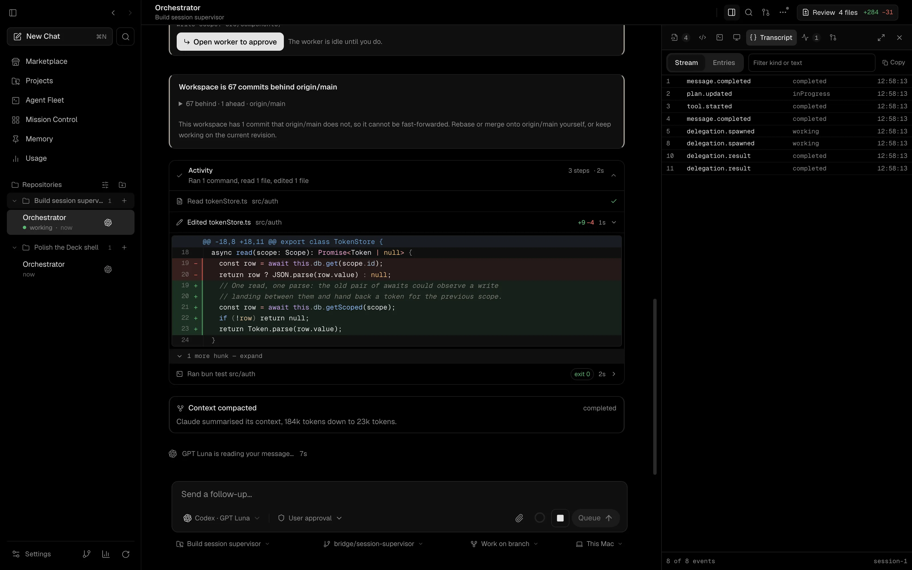
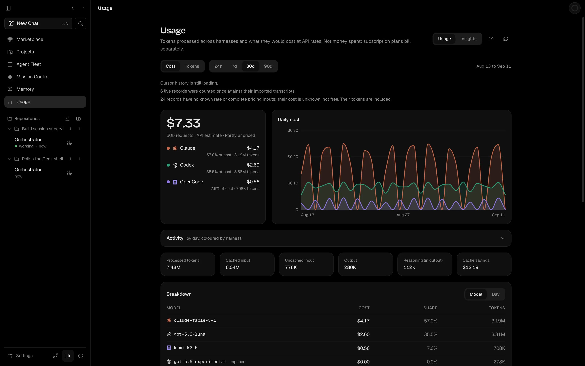

<h1 align="center">Bridge</h1>

<p align="center">
  <strong>The control room for coding agents.</strong><br/>
  Run Codex, Claude Code, OpenCode, Cursor, and Grok side by side — safely, on your Mac, with your own subscriptions.
</p>

<p align="center">
  <a href="https://bridge.agentclash.dev/download"><strong>Download for macOS</strong></a>
  ·
  <a href="https://bridge.agentclash.dev">Website</a>
  ·
  <a href="https://bridge.agentclash.dev/changelog">Changelog</a>
</p>

<p align="center">
  <sub>macOS 12+ · Apple Silicon · Early-stage, under active development</sub>
</p>

<p align="center">
  <a href="https://github.com/Atharva-Kanherkar/bridge-harness/actions/workflows/ci.yml"></a>
  <a href="LICENSE"></a>
  <a href="https://github.com/Atharva-Kanherkar/bridge-harness/issues"></a>
</p>

<p align="center">
  
</p>

---

## What is Bridge?

Bridge is a native macOS app for working with AI coding agents on real projects. Point it at a Git repository, start a session with the agent you want, and get your work done — without living in the terminal and without worrying about an agent trampling your checkout.

Use your existing agent subscriptions. Your code and your credentials stay on your machine.

## Why Bridge?

- **One place for every agent.** Start Codex, Claude Code, OpenCode, Cursor, or Grok sessions from the same window and switch between them freely.
- **Set up in one screen.** First launch finds the agents you already have, installs the ones you want, and runs each provider's own sign-in.
- **Experiment without fear.** Each task gets its own isolated workspace, so agents can try things without touching your main branch.
- **Nothing gets lost.** Conversations are saved automatically. Rewind, fork, or resume a session days later — right where you left off.
- **You're always in charge.** Agents ask before running anything risky. You approve or decline in one click.
- **Know what you're spending.** See usage, rate limits, and context health per provider before you hit a wall.
- **It remembers how you work.** Save preferences and project knowledge once; Bridge surfaces the right bits in future sessions.

## What you can do with it

### Start with the agents you already have

Open Bridge for the first time and it scans your machine before asking you for anything. Agents it finds are marked **Detected**; ones you're already signed in to are simply **Signed in** — no second login, no setup you've already done twice. Anything missing can be installed in place, and sign-in runs in a quiet pane with a direct link to the provider's own page rather than a raw terminal.

### Work with any of your agents

Chat in a clean native UI — messages, reasoning, plans, tool calls, diffs, and approvals rendered properly instead of crammed into a terminal.

<p align="center">
  
</p>

<p align="center"><sub>Switch model or provider inside one conversation. The provider session restarts; your history stays.</sub></p>

<p align="center">
  
</p>

<p align="center"><sub>Agent Fleet runs the CLIs themselves, split into one terminal grid per checkout.</sub></p>

### Keep tasks safely separated

Spin up a task workspace per piece of work. Agents work in their own branch and folder; your main checkout stays clean. Run a second opinion in parallel when it matters.

### Stay in control of risky actions

Commands, file writes, and delegation requests outside the agreed scope pause for your approval. Review the exact diff before anything lands.

<p align="center">
  
</p>

<p align="center"><sub>Every change is reviewable where it happened, ranked by blast radius.</sub></p>

<p align="center">
  
</p>

<p align="center"><sub>A completion gate can demand a second harness family before you adopt anything.</sub></p>

### Never lose a thread

Every session is stored locally and stays inspectable. Go back to an earlier point, fork the conversation to try a different approach, or resume after a restart — without losing what the agent already figured out.

<p align="center">
  
</p>

<p align="center"><sub>An append-only ledger of what actually happened, filterable and forkable.</sub></p>

### See costs and limits up front

Per-provider usage, rate-limit status, and context pressure are visible in the app, so you can switch models or wrap up before quality degrades.

<p align="center">
  
</p>

<p align="center"><sub>Cost per harness and per model, with what the cache saved you.</sub></p>

### Read a page without leaving the app

The dock's browser pane is a plain in-app browser — URL bar, back, forward, reload — for docs, a dashboard, or the PR you're discussing. Pages that refuse to be framed open in your system browser instead.

### Keep project knowledge

Store the preferences, conventions, and decisions agents should follow. Recall them in any session, on any workspace.

### Stay connected to GitHub

Browse issues and pull requests, open work from a task, and keep the conversation tied to the code under review.

## Works with your subscriptions

| Agent | CLI | Bridge can install it |
| --- | --- | --- |
| Codex | `codex` | Yes |
| Claude Code | `claude` (needs Node.js 18+) | Yes |
| OpenCode | `opencode` | Yes |
| Cursor | `cursor-agent` | Yes |
| Grok | `grok` | Install it yourself |

Sign-in always runs the vendor's own login command. Bridge never collects, stores, or logs your provider credentials.

Missing an agent? It simply shows as unavailable — Bridge still starts and everything else keeps working. Your own installs always take precedence over the ones Bridge manages.

## Get started

1. **Download Bridge** from [the download page](https://bridge.agentclash.dev/download) or [GitHub Releases](https://github.com/Atharva-Kanherkar/bridge-harness/releases) — open the `.dmg`, drag **Bridge** into Applications, and launch it.
2. **Pick your agents** — first launch shows what's already on your machine and installs or signs in to the rest.
3. **Add a project** — pick a local Git repository.
4. **Start working** — create a workspace, pick your agent and model, and send your first message.

Approvals, history, and usage tracking are on from the start.

## Download

- **Release builds:** [GitHub Releases](https://github.com/Atharva-Kanherkar/bridge-harness/releases) — look for `Bridge_*.dmg`, signed with a Developer ID, notarized, and stapled
- **Requirements:** macOS 12 or later (Apple Silicon), Git, and Node.js 18+ (only needed for Claude sessions)
- **Linux:** Debian, AppImage, and Arch packages build in CI as release candidates. They are not published downloads yet — see [docs/linux-release.md](docs/linux-release.md).
- **Updates:** in-app auto-update isn't in this release yet — grab new builds from Releases. See the [CHANGELOG](CHANGELOG.md) for what's new.

> [!NOTE]
> Bridge is early-stage software. Expect rough edges and frequent improvements. macOS may ask for file access the first time Bridge touches `Desktop`, `Documents`, or `Downloads` — keeping repos in a folder like `~/Code` avoids repeated prompts.

## Learn more

- [CHANGELOG](CHANGELOG.md) — what shipped in each release
- [docs/session-forest.md](docs/session-forest.md) — how history, rewind, and resume behave
- [docs/delegation-policy.md](docs/delegation-policy.md) — how supervised multi-agent work stays bounded
- [docs/compaction-and-resume.md](docs/compaction-and-resume.md) — checkpoints and session restoration
- [docs/managed-agent-runtimes.md](docs/managed-agent-runtimes.md) — how Bridge installs and verifies agent runtimes
- [docs/worktree-lifecycle.md](docs/worktree-lifecycle.md) — how task workspaces are created and reclaimed
- [docs/protocol/README.md](docs/protocol/README.md) — the RPC contract between the app and the runtime
- [docs/work-brief.md](docs/work-brief.md) — the daily work briefing

## Contributing

Bridge is a **Tauri 2** app with a **Rust** workspace under `src-tauri/` and a **React + TypeScript + Vite** frontend styled with **Tailwind CSS v4**, managed with **Bun**.

See **[CONTRIBUTING.md](CONTRIBUTING.md)** for prerequisites, the full command table (`bun run dev`, `bun run tauri dev`, `bun run check`, `bun run build`, `bun run test`), pull request expectations, and issue etiquette ([`docs/issue-format.md`](docs/issue-format.md) — every issue needs **For humans** and **For agents** sections).

Agent and UI conventions: **[AGENTS.md](AGENTS.md)**.

<details>
<summary><strong>Quickstart (from source)</strong></summary>

```sh
git clone https://github.com/Atharva-Kanherkar/bridge-harness.git
cd bridge-harness
bun install
bun run dev        # fast frontend iteration (mock data, no Rust shell)
bun run tauri dev  # full desktop app
```

Before opening a PR:

```sh
bun run build
bun run test
```

</details>

## License

Bridge is open source under the [MIT License](LICENSE). Use it, fork it, ship it.

Third-party code carries its own terms; see [THIRD_PARTY_NOTICES.md](THIRD_PARTY_NOTICES.md).
