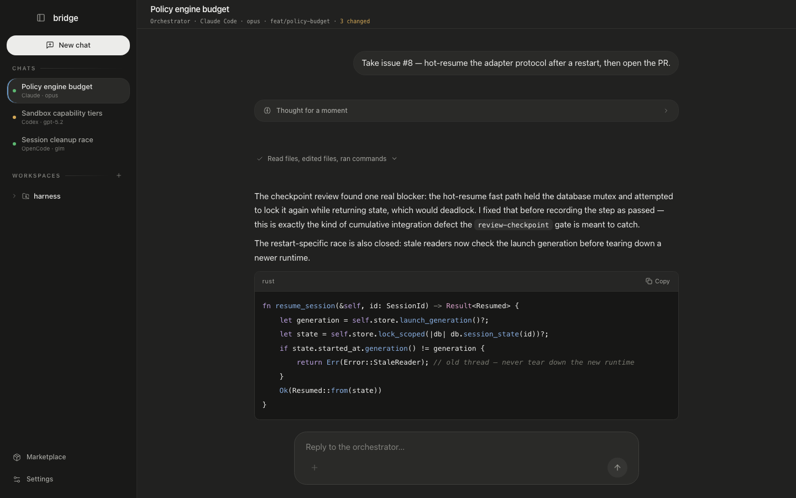
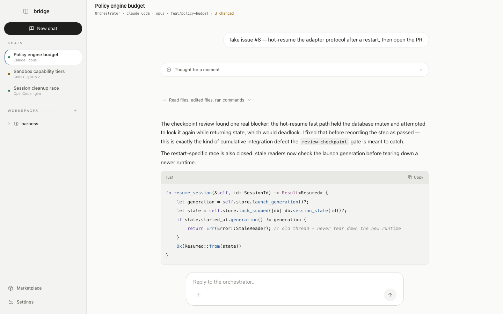
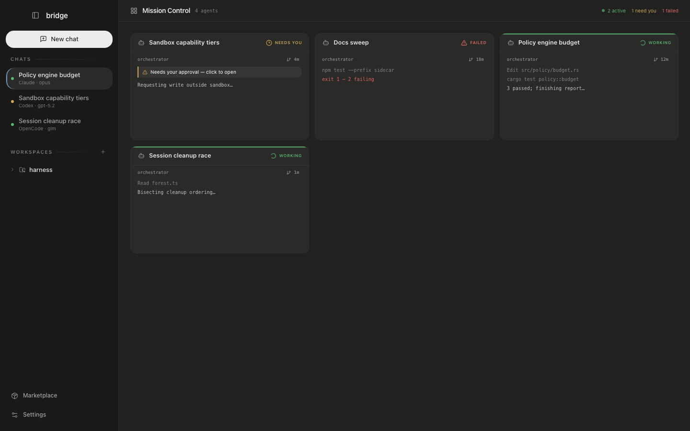
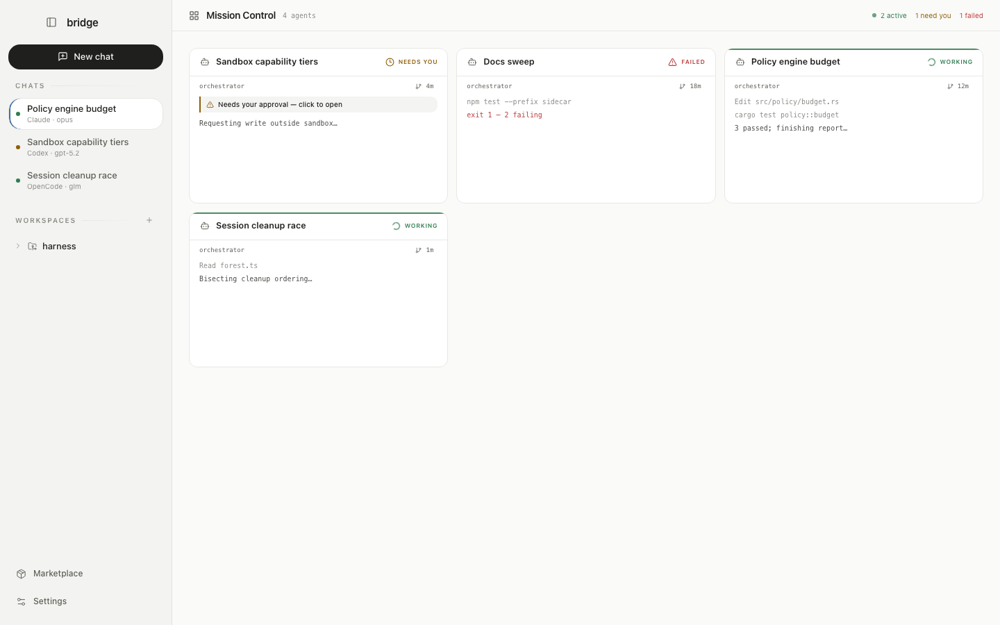
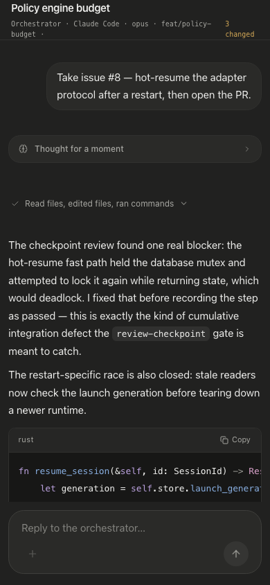
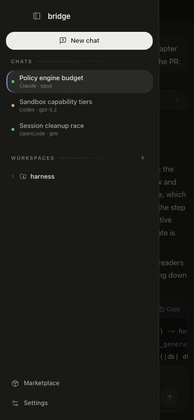
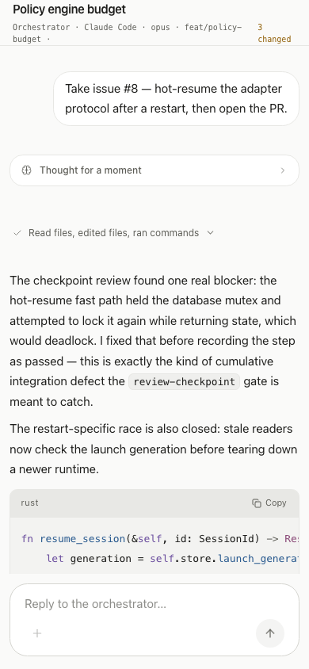

# Graphite &amp; Paper

Bridge's design system. Bridge hosts Codex, Claude Code, and OpenCode side by side, so its chrome
stays achromatic and **colour only ever carries meaning** — agent status, diffs, and approvals.

The direction was drawn from how those three products dress themselves. They converge on the same
grammar: elevation as a lightness ladder rather than borders and shadows, near-zero chroma in the
chrome, a pill composer, monospace reserved for code and paths, tool calls collapsed into labelled
rows, and no glass anywhere.

## Tokens

Both modes are renderings of the same token names, defined in [`src/index.css`](../../src/index.css).

|                | Light · paper | Dark · graphite |
| -------------- | ------------- | --------------- |
| `--sidebar`    | `#F3F3F1`     | `#191918`       |
| `--background` | `#FAFAF9`     | `#212120`       |
| `--card`       | `#FFFFFF`     | `#2A2A28`       |
| `--popover`    | `#FFFFFF`     | `#323230`       |
| `--border`     | `#E7E7E4`     | `#31312F`       |
| `--foreground` | `#1F1F1D`     | `#ECECEA`       |
| `--muted-foreground` | `#5D5D57` | `#A8A8A3`      |
| `--primary`    | `#1F1F1D`     | `#ECECEA`       |
| `--ring`       | `#3D6FA5`     | `#6A9BCC`       |
| `--success`    | `#2F7D4F`     | `#5DB872`       |
| `--warning`    | `#8F5E05`     | `#D4A957`       |
| `--info`       | `#3D6FA5`     | `#6A9BCC`       |
| `--destructive`| `#BE3D3D`     | `#E5695E`       |

Four rules hold the system together:

1. **Elevation is a ladder** — `sidebar` < `background` < `card` < `popover`. Resting surfaces are
   opaque; only genuinely floating layers (menus, dialogs, toasts) get a shadow. Nothing blurs at rest.
2. **The primary action is an inversion**, not a hue: `bg-primary text-primary-foreground` is ink on
   paper and paper on ink.
3. **One slate signal** carries focus rings, links, text selection, and the active-session tick. It is
   interaction plumbing, deliberately too quiet to brand anything.
4. **Status ink is the hue itself** (`text-success`). The `*-foreground` variants are the ink that sits
   *on* a full-strength status fill and are near-black in dark mode — never use them on a wash.

Type is a single family: Geist 400/500/600, with hierarchy from weight rather than a second display
face. Geist Mono is reserved for paths, commands, telemetry, and diffs. Base radius is `0.75rem`.

## Session view

The transcript follows the grammar the reference products share: the user's message in a bubble, the
agent's reply naked on the canvas, tool calls as collapsed mono rows with the result right-aligned,
and the diff carrying the only saturated colour.

### Dark · graphite

### Light · paper

## Mission Control

Tiles sit one ladder step above the canvas. Status is carried by the semantic ramp, the live bar is a
solid success edge, and an approval is a neutral row with a warning tick rather than a tinted alarm
panel — so a grid of busy agents never becomes a wall of colour.

### Dark · graphite

### Light · paper

## Responsive

The window goes down to 420px. Below the `sm` breakpoint the sidebar becomes an off-canvas drawer over
a scrim, with a title bar that clears the macOS traffic lights.

| Transcript at 390px | Drawer open | Paper at 390px |
| --- | --- | --- |
|  |  |  |

## Theming

The app follows macOS appearance unless a mode is pinned in **Settings › Appearance**. The preference
is stored under `bridge.theme` and resolved by an inline script in `index.html` before first paint, so
the window never flashes the wrong ground. [`src/theme.ts`](../../src/theme.ts) owns the logic;
`useThemePreference()` keeps every consumer in sync.

Anything that cannot read a CSS custom property — the xterm terminal, mermaid diagrams — reads the
resolved tokens from the document and re-themes when the mode flips.

## Guard rails

[`src/designSystem.test.ts`](../../src/designSystem.test.ts) fails the build on:

- a Tailwind palette class (`text-neutral-500`, `bg-emerald-400`, …) anywhere in `src/`
- a white/black alpha wash (`bg-white/[0.05]`, `border-white/10`)
- a raw hex literal outside the one allowlisted file
- `backdrop-blur` on a class string that also names a resting surface
- `text-<status>-foreground` used anywhere but on a full-strength `bg-<status>`

It also asserts the ladder rungs stay distinct within each mode, that both grounds are exactly
`#FAFAF9` and `#212120`, that `--primary` equals `--foreground`, that no `color-scheme` is pinned on
the document, and that reduced motion is honoured.

Screenshots on this page are the real components rendered against the real compiled CSS with
representative session data.
