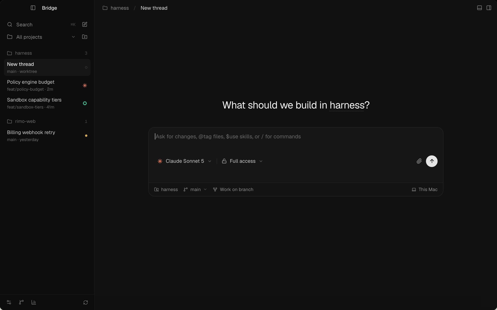
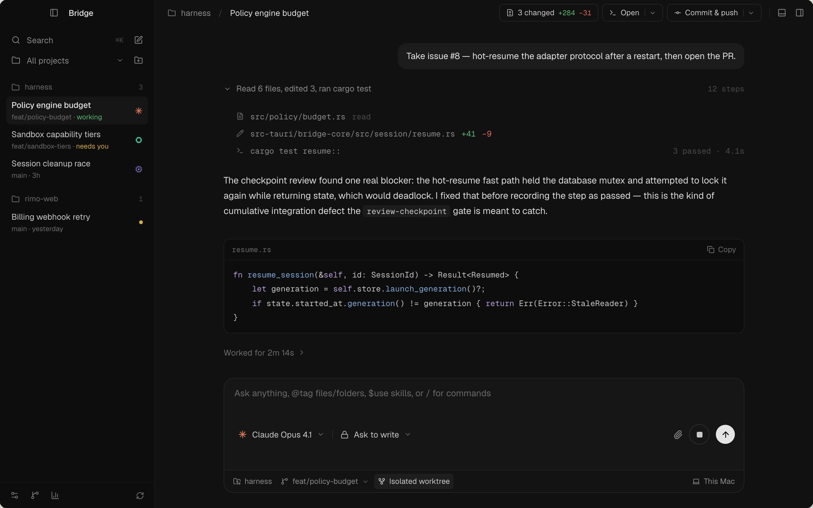
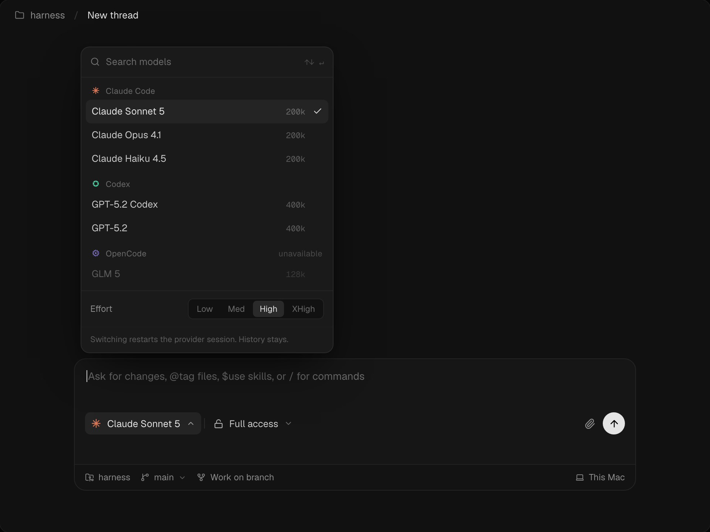

# Near-black redesign · mockups

The same achromatic system as [Graphite &amp; Paper](../graphite-paper.md), rendered tighter, darker
and denser. Colour still only ever carries meaning — harness marks and status ink.

Screens are labelled as they are on the canvas. [`canvas.html`](canvas.html) is the self-contained
source: open it in a browser and pan/zoom to see all three at once, plus the token swatches.

## 1a · New thread

Sidebar groups threads under their project. Hero line, and a composer that carries model, access,
attach and send inline with the context strip attached beneath it as a footer.

## 1b · Session

Breadcrumb toolbar with the change count and the `Open` / `Commit &amp; push` chips. One collapsed
activity row expands to mono tool rows; agent prose sits naked on the canvas under a
`Worked for 2m 14s` trailer.

## 2a · Model picker

Search header, harness-grouped rows with context size in mono, unavailable harness dimmed, and the
effort segmented control in the popover footer — which retires the `High · 200k` pill from the
composer.

